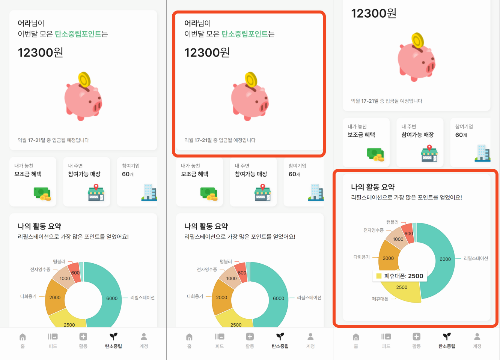

# 시연 시나리오

## 목차

- ### [테스트 화면](#테스트-시연)
- ### [홈 화면](#홈-화면-시연)
- ### [피드 탭](#피드-탭-시연)
- ### [활동 탭](#활동-탭-시연)
- ### [탄소중립 탭](#탄소중립-탭-시연)
- ### [경고장](#경고장)
- ### [마이페이지](#마이페이지--친구페이지)
 

# 테스트 시연

## 테스트 초기화면

### 친구의 초대를 받고 테스트 링크를 클릭하면 테스트 초기화면에 진입하게 됩니다.

## 테스트 진행

### 테스트는 평소 환경보호에 대한 인식과 실천에 대한 질문과 선택지로 이루어져있습니다. 
### 테스트가 끝나면 선택한 답변에 따라 본인의 점수와 벌금을 측정합니다. 
### 이때 측정한 벌금은 회원 가입 후 앱 사용시 반영되게 됩니다.

 

# 홈 화면 시연

## 홈 화면

### 사용자가 앱에서 한 활동에 따라 지구의 상태가 변하게 됩니다.
### 홈 화면에서는 유저가 현재 갚아야 할 빚과 이를 쉽게 확인할 수 있는 프로그레스 바를 확인 할 수 있습니다.

### 주간 활동요약을 통해 유저가 일주일동안 앱을 통해 환경 활동을 인증 했는지 한 눈에 확인 할 수 있습니다. 활동한 요일 하단에는 초록색 사각형이 표시됩니다.

 

# 피드 탭 시연
## 피드 탭 화면

### 피드 탭에서는 현재 친구인 사용자들의 최근 활동 목록을 확인 할 수 있습니다.
### 상단의 검색바를 통해 친구가 아닌 다른 사용자들을 검색하고 해당 사용자의 페이지로 이동이 가능합니다.
### 피드에 활동을 클릭하게 되면 해당 활동을 상세하게 볼 수 있는 페이지로 이동하게 됩니다.

# 활동 탭 시연
## 활동 탭 화면

### 활동탭에서 사용자는 환경과 관련된 활동을 인증 할 수 있습니다.
### 활동 카테고리는 현재 시행중인 탄소중립포인트제도와 연계되는 활동들로 구성했습니다.
### 카테고리를 클릭하게 되면 활동을 인증할 수 있는 화면으로 넘어가게 됩니다.
### 사용자는 해당 활동 카테고리에 연계된 기업과 관련된 활동이라면 체크하고 인증할 수 있습니다. 이렇게 인증하게되면 본인의 탄소중립포인트 적립을 트래킹할 수 있습니다.
### 또한 인증활동사진을 업로드할때 원하는 부분을 크롭하여 올릴 수 있는 기능을 제공하고 있습니다.

 

# 탄소중립 탭 시연
## 탄소중립 탭 화면

### 탄소중립탭에서는 사용자의 탄소중립포인트와 관련된 정보들이 있습니다.
### 사용자가 활동을 통해 적립된 예상 탄소중립포인트를 확인할 수 있습니다.
### 또한 사용자가 해왔던 관련 활동들에 대해 적립된 탄소 중립 포인트를 기준으로 원그래프로 한 눈에 확인 할 수 있도록 했습니다.

## 탄소중립 탭 제도 가입

### 앱에서 아직 탄소중립포인트 제도를 가입하지 않은 사용자를 위해 가입할 수 있는 페이지로 바로갈 수 있는 화면이 있습니다.

## 탄소중립 매장 지도 확인

### 사용자의 현재 위치를 기반으로 주변 탄소중립포인트를 적립할 수 있는 매장을 볼 수 있는 화면이 있습니다.

### 자신의 주변의 매장을 확인할 수 도 있고 지도를 다른 위치로 옮기면 해당 위치를 주변으로 매장을 확인할 수 도 있습니다.

### 또한 활동 카테고리에 따라 주변 매장을 확인할 수 있습니다.

 

## 탄소중립 연계 기업 목록 확인 및 연동

### 탄소중립포인트 제도는 현재 기업들과 연계되어 운영되고 있습니다.

### 사용자가 앱을 통해 간편하게 탄소중립포인트 연계 기업 목록을 확인 할 수 있게 화면을 구성했습니다.

### 목록에서 특정 기업을 클릭할 경우 해당 기업의 탄소중립포인트 제도 운영 방침과 자신의 연동여부를 확인할 수 있습니다.

### 자신이 해당 기업에 대해 탄소중립포인트 제도를 연동했는지 여부를 앱을 통해 스스로 체크하며 탄소중립포인트 제도를 좀 더 편하게 활용할 수 있습니다.

 

# 경고장

## 경고장 보내기

### 저희 앱에서는 다같이 환경 활동을 독려할 수 있도록 경고장 기능을 추가했습니다.

### 친구가 환경 보호에 안좋은 활동을 한다면 이를 제보하고 친구에게 벌금을 부과하는 형식입니다.

### 먼저 환경에 안 좋은 영향을 주는 활동들을 경고 사유에 넣었습니다. 

### 다음으로  귀여운 디자인의 경고장 템플릿을 고릅니다.

### 마지막으로 해당 활동을 한 친구를 고르고 이에 대한 증거 사진을 제출합니다. 경고장을 보내게 된다면 친구는 자신의 마이페이지에서 이를 확인할 수 있습니다.

 

# 마이페이지

## 마이페이지 & 친구페이지

### 저희 앱에서는 자신이 해왔던 활동들과 친구들에게 받았던 경고장을 썸네일을 통해 한번에 확인할 수 있는 마이페이지를 제공하고 있습니다.

### 또한 마이페이지와 마찬가지로 피드나 검색을 통해 들어갈 수 있는 친구페이지에서도 똑같이 친구의 활동들과 받았던 경고장들을 볼 수 있습니다.
